# Lab 2 - CST8915 Full-stack Cloud-native Development
## student: Olga Durham
## st#: 040687883

### In this lab, I do:

1. Refactor the *Algonquin Pet Store* application to comply with the first four factors of the *12-Factor App:* **Codebase**, **Dependencies**, **Configuration**, and **Backing Services**.
2. Deploy each component of the application on its own Azure VM:
    - **RabbitMQ** on a dedicated VM (as the backing service)
    - **order-service** on a dedicated VM
    - **product-service** on a dedicated VM
    - **store-front** on a dedicated VM
3. Configure all services to communicate across VMs using environment variables, ensuring that the `order-service` connects to the external `RabbitMQ` instance.

## Refactoring for 12-Factor Compliance
### Factor 1: Codebase
A single codebase should be used, with version control, for each microservice.

1. **Create a separate GitHub repository** under your GitHub account for each service.
    - For example, create three repositories:
        - `order-service`
        - `product-service`
        - `store-front`
2. **Copy the content** for each service from the existing codebase on *Algonquin Pet Store*.
    - The `order-service` code is found in the `order-service` directory.
    - The `product-service` code is found in the `product-service` directory.
    - The `store-front` code is found in the s`tore-front` directory.
3. **Push each service** to its respective repository. This way, each service will have its own codebase, tracked separately.

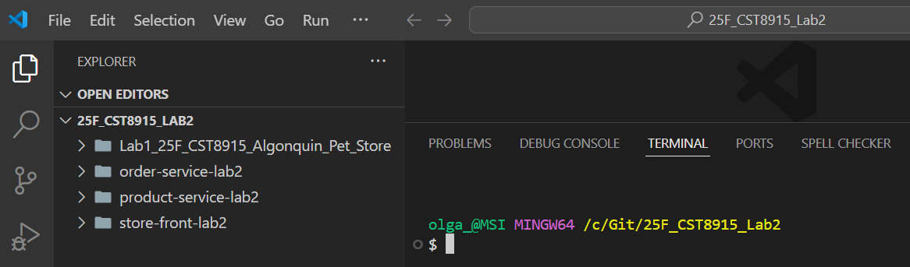

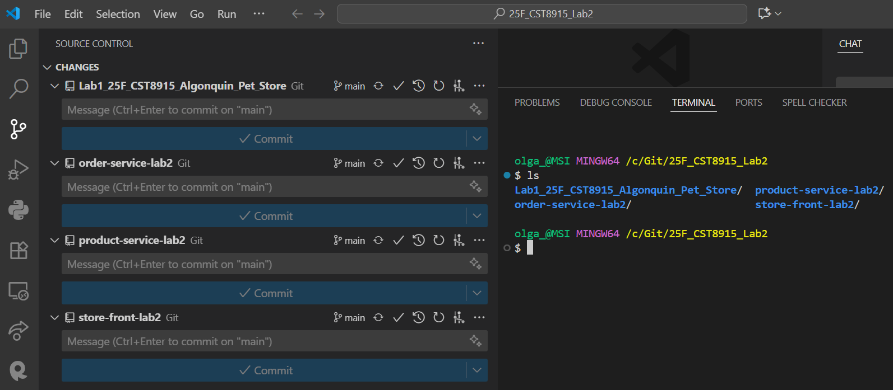

1. **One codebase = one repo.**
Each microservice (like `order-service`, `product-service`, `store-front`) should live in its *own* GitHub repository.

The codebase is tracked in version control.
That means Git is used to keep the history of the code, who changed what, and when.

Deployments are copies of that one codebase.
You might run the same service on multiple servers/VMs (for scaling), but they all come from the same repo.

### Factor 2: Dependencies

Explicitly declare and isolate dependencies.

1. Ensure all dependencies are declared in a dependency management file.

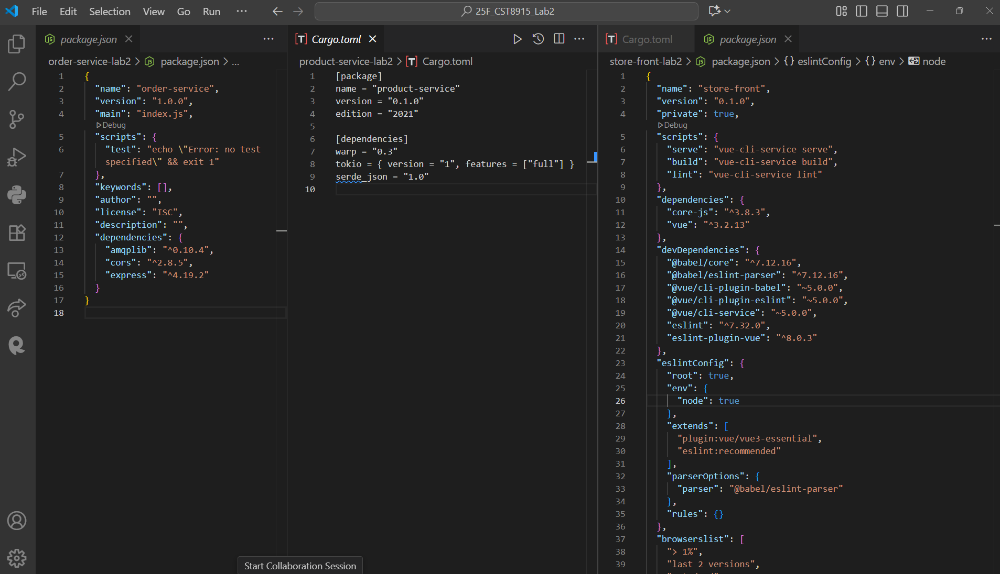

2. Use dependency isolation.
- **Node.js (Order-Service)**: Use `npm install` to install dependencies in the `node_modules` directory and avoid using global dependencies. This ensures that all modules are isolated to the application and not globally installed on the machine.
    - The `node_modules` folder will be created locally within the project directory, ensuring dependencies are specific to the app.

*Install dependencies:*

*The service depends on several npm packages (such as express for the web server and amqplib for RabbitMQ communication). Install these dependencies using npm:*

*`npm install`*

*Run the service:*

*Once all dependencies are installed, start the service:*

*`node index.js`* 

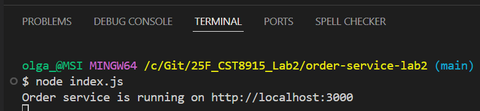

<u>*The service is running in isolated environment*</u>

### Factor 3: Configuration

Store configuration in the environment.

1. Configure `order-service`

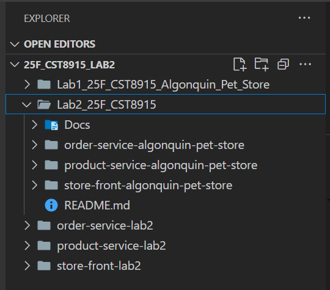

`index.js` file modification

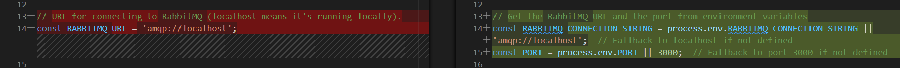

Extract any hard-coded configuration from the code (such as database URLs, RabbitMQ connection strings, ports, etc.) into environment variables.

New file `.env` has been added

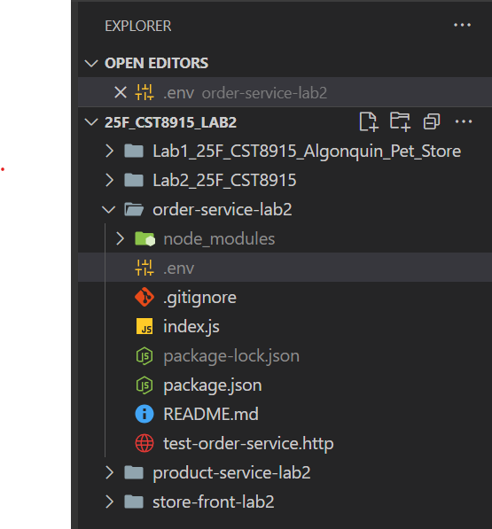

Added new library `dotenv`

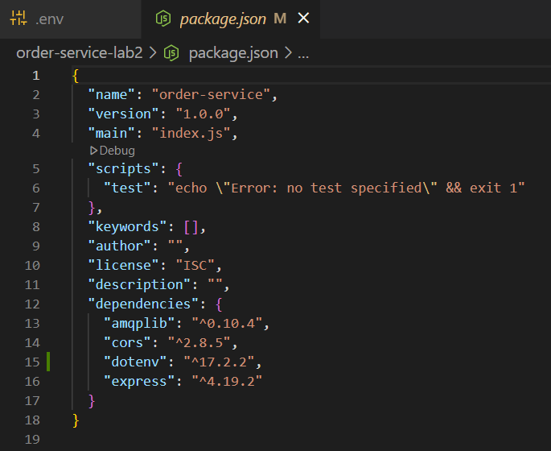

Added code to `.env`file

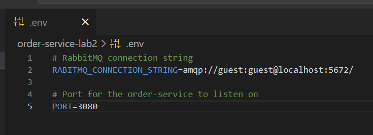

Run order service

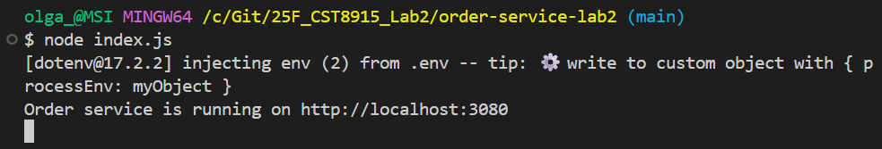

Test the order-service

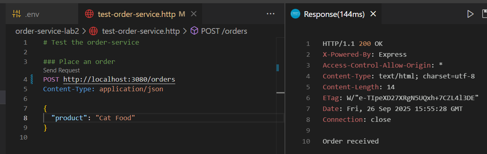

2. Configure product-service

Updated `product-service` files

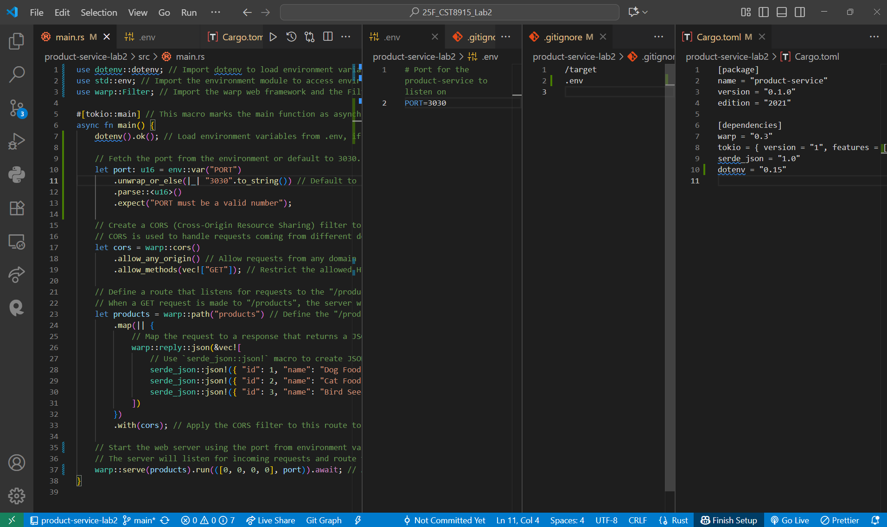

Install Rust

Run `cargo run` command

Test the `product-service`

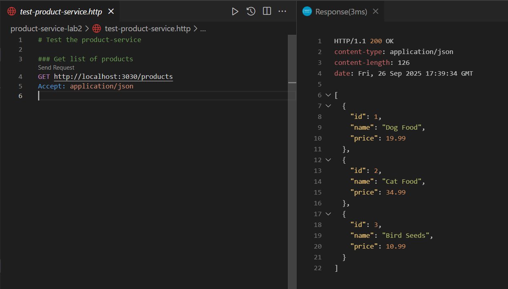

3. Configure store-front

Updated `src` folder

Method `fetch` OrderForm.vue updated

