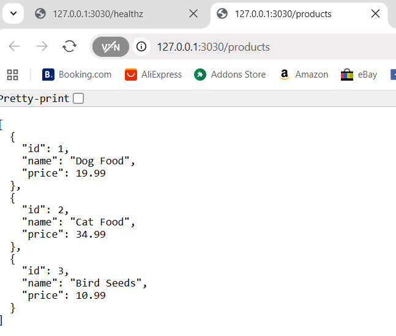

# Lab 3 - CST8915 Full-stack Cloud-native Development: Deploying the Algonquin Pet Store on Azure

### Student: Olga Durham
### St#: 040687883

## Step 1. Create and Configure an Azure VM for RabbitMQ

   1.1. RabbitMQ-Server created

   

   1.2. Run RabbitMQ on Public IP and login

   

   1.3. Publish a test message

   

## Step 2: Rewrite the Product-Service

### 2.1. Choose a Programming Language

I rewrote the Rust product-service in Python (Flask) because Python is natively supported by Azure App Service, has a simple deployment story (Gunicorn + App Settings). The new service lives at:
Lab3/product-service-lab3/
  app.py
  requirements.txt
  .env.example
  .gitignore

### 2.2 12-Factor Compliance (first four factors)

#### I. Codebase

One codebase tracked in Git (Lab3/product-service-lab3), deployed to multiple environments later (local, Azure Web App).

#### II. Dependencies

- All dependencies are in requirements.txt:

   - Flask, 
   - Flask-Cors, 
   - python-dotenv 
   - gunicorn for Azure runtime

- No global/system packages are assumed

#### III. Config

- Runtime configuration comes from environment variables
- PORT is read from env (defaults to 3030 for local dev)
- A sample file .env.example documents required variables. In production (Azure), config will be set in App Settings, not in .env

#### IV. Backing Services

- RabbitMQ is treated as an attached resource, referenced by URL via env (e.g., RABBITMQ_URL)
- Rust file for this step doesn’t publish to RabbitMQ; the Flask rewrite mirrors that contract 
- A RabbitMQ health/publish endpoint can be added later without changing deploy strategy

### 2.3 Rewrite the Service (same endpoints & logic)

- Framework: Flask with Flask-CORS to match Rust CORS behavior (allow any origin, GET only)

- Endpoints (mirrors the Rust version):

   - GET /products → returns the same static list of three products

   - GET /healthz → simple health probe (useful for Azure + grading)

- Port binding: 0.0.0.0:$PORT (12-Factor “port binding”; works locally and on Azure)

- Logging: defaults to stdout (captured by Azure logs)

#### Key files

- app.py (core API):

   - reads PORT from env (default 3030),

   - sets permissive CORS for GET,

   - implements /products and /healthz

- requirements.txt (pinned deps)

- .env.example (documents PORT=3030 for local dev)

### 2.4 Test Locally

- Service starts locally and binds to the configured port

- Endpoints return the expected JSON, matching the Rust contract

- Open in a browser:

   - http://localhost:3030/healthz

   

   - http://localhost:3030/products

   

Local tests passed. The service is now ready to be deployed on Azure Web App, using a production WSGI server (Gunicorn) and an Azure startup command such as:
`gunicorn app:app --bind=0.0.0.0:$PORT`
