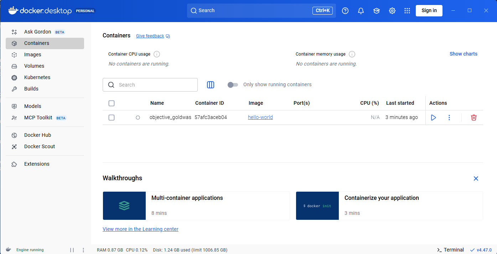
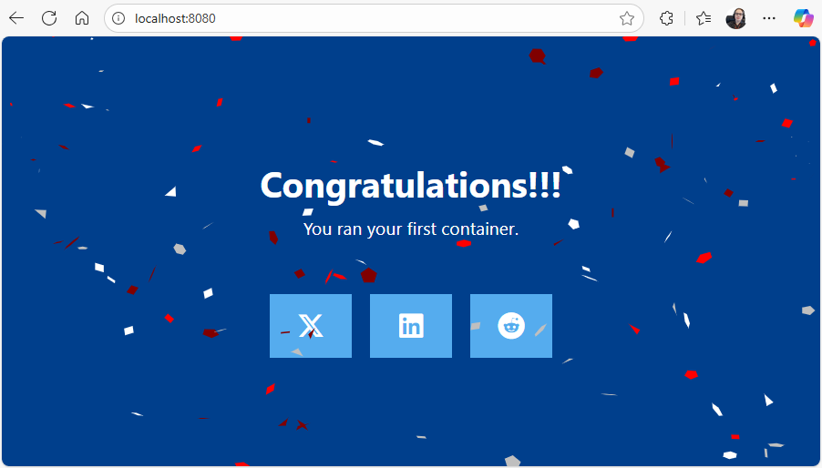
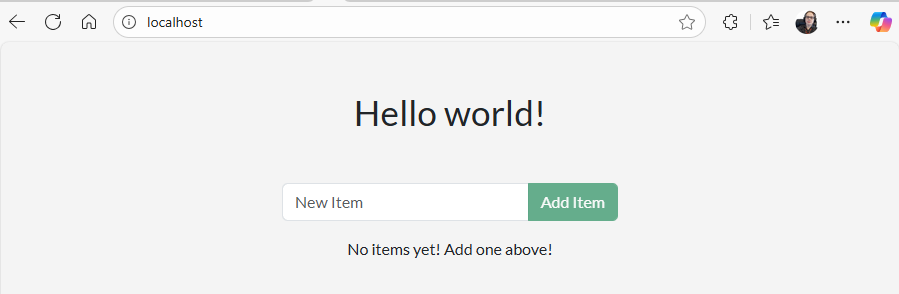

# Lab 4 - CST8915 Full-stack Cloud-native Development: Introduction to Docker

### Student: Olga Durham
### St#: 040687883

## Prelab (Install and Run Docker locally):

### Step 1: Docker Desktop

Docker Desktop installed and running

docker run -d -p 8080:80 docker/welcome-to-docker

Running on local host

### Step 2: Develop with containers
Complete Develop with containers Guide (Video Included)

[getting-started-todo-app](https://github.com/shap0011/getting-started-todo-app.git)

The application up and running

### Step 3: Build and push your first image
Complete Build and push your first image (Video Included)