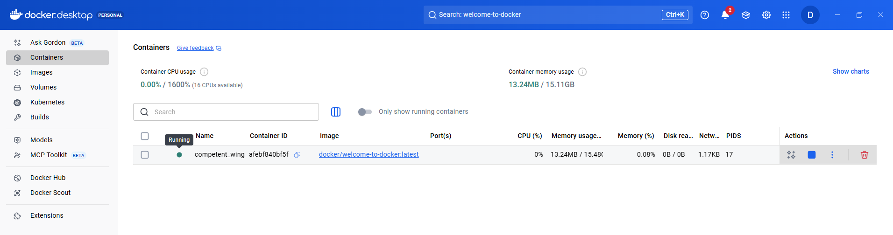
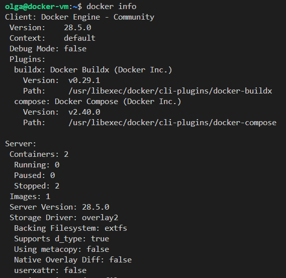
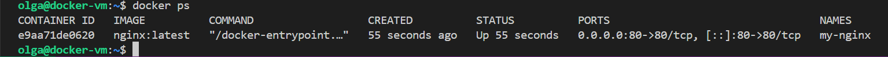
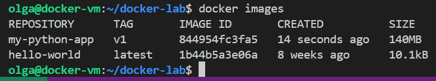
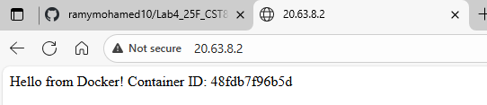

# Lab 4 - CST8915 Full-stack Cloud-native Development: Introduction to Docker

### Student: Olga Durham
### St#: 040687883

## Prelab (Install and Run Docker locally):

### Step 1: Docker Desktop

Docker Desktop installed and running

docker run -d -p 8080:80 docker/welcome-to-docker

Running on local host

### Step 2: Develop with containers
Complete Develop with containers Guide (Video Included)

*[getting-started-todo-app](https://github.com/shap0011/getting-started-todo-app.git) (Click to open on GitHub)*

#### The application up and running

#### Make changes to the app

#### Change the placeholder text

#### Change the background color

### Step 3: Build and push your first image
Complete Build and push your first image (Video Included)

#### Image is on Docker Hub

#### The app opened on localhost:3000

## Part 1: Setting Up Your Docker Host on Azure

### Step 1.1: Create an Ubuntu VM (Standard_B2s) on Azure

#### Ubuntu VM created

### Step 1.2: Connect to Your VM using VS Code

#### Azure VM connected successfully via VS Code Remote SSH

### Step 1.3: Install Docker Engine Using APT Repository

### Step 1.4: Verify Docker Installation

#### Docker installation verified

#### User olga added to the docker group

Docker commands running without sudo

## Part 2: Docker Fundamentals

### Step 2.1: Understanding Docker Architecture

- Docker Client: The interface you use (docker CLI)

- Docker Daemon: The background service that manages containers

- Docker Registry: Storage for Docker images (e.g., Docker Hub)

#### Docker Architecture

### Step 2.2: Basic Docker Commands

#### Container is running and serving port 80

#### Container and image cleaned up

## Part 3: Working with Dockerfiles

### Step 3.1: Understanding Dockerfiles

### Step 3.2: Create Your First Dockerfile

#### Created a Dockerfile with instructions to build a containerized Flask application.

### Step 3.3: Build the Docker Image

#### All local images including the newly built my-python-app image.

### Step 3.4: Run Your Containerized Application

#### Test the application

#### App is running in browser

## Part 4: Understanding Docker Images and Layers

### Step 4.1: Image Layers Explained

### Step 4.2: Inspect Image Layers

### Step 4.3: Understanding Layer Caching

