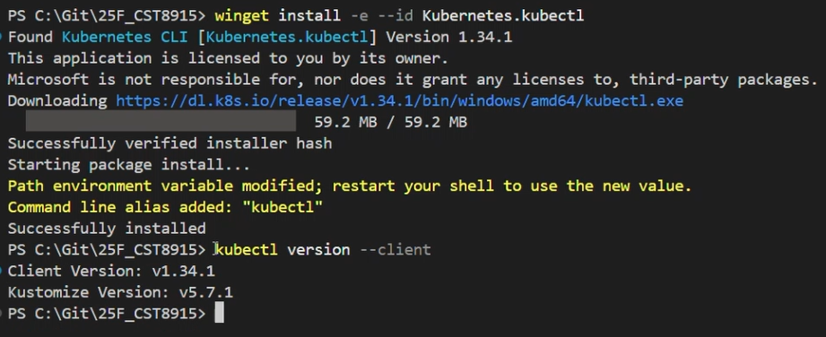
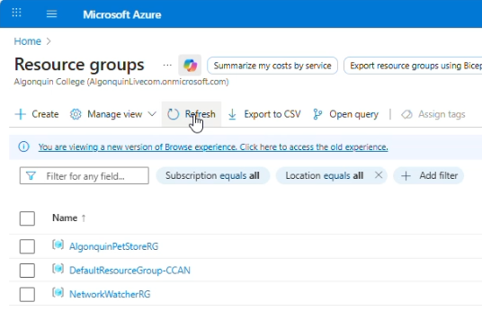
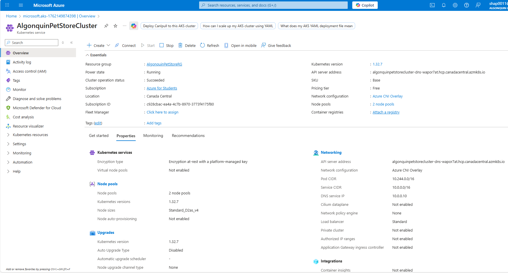
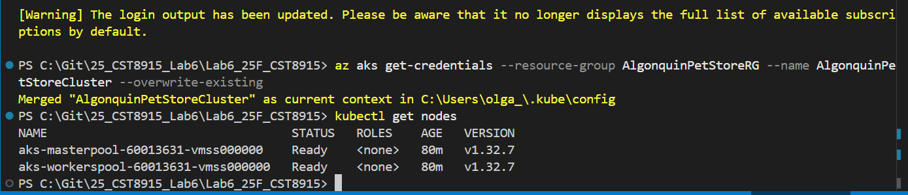
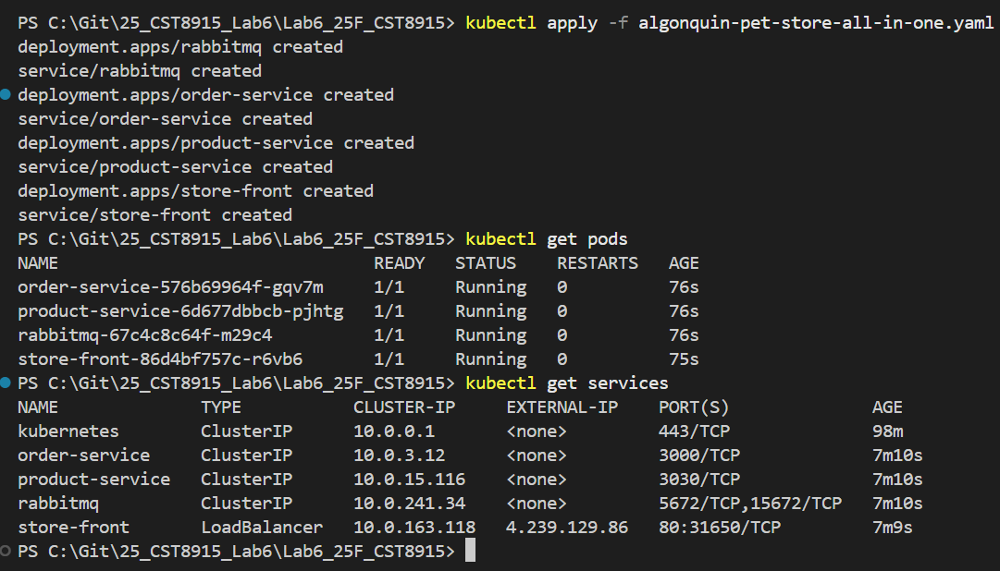
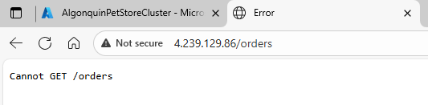
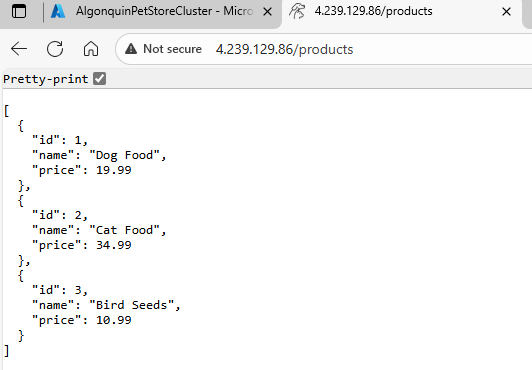
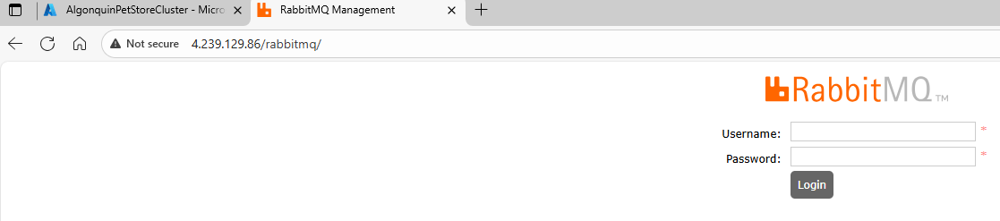

# Lab 6 - CST8915 Full-stack Cloud-native Development: Deploy Algonquin Pet Store to Azure Kubernetes Service (AKS)

**Student: Olga Durham**

**St#: 040687883**

---

## In this lab:

I'm gaining hands-on experience deploying microservices to AKS, connecting to the cluster using kubectl, and exposing the application to the internet.

---

## Lab Tasks: Updating API Endpoints

1. Read `kubectl` documentation: https://kubernetes.io/docs/reference/kubectl/
2. Test the essential `kubectl` commands in the provided `Kubectl-Cheat-Sheet.md` file.
3. The application’s various services (such as `product-service`, `order-service`, and `RabbitMQ Management Console`) are all accessible via the same IP address, differentiated by paths (`/products`, `/orders`, `/rabbitmq`).

- Figure out how this setup is possible.
- Store-front was slightly modified to achieve that. Examine the updated store-front repo: https://github.com/ramymohamed10/store-front-L6.
- **Hint:** start by investigating `nginx.conf` file.

---

## Step 1: Install `kubectl`

**1. What is `kubectl`?**

- `kubectl` is a command-line tool that allows you to communicate with and manage Kubernetes clusters. You will use `kubectl` to deploy applications, configure clusters, and inspect resources.

**2. Installing `kubectl`:**

- Follow the official installation guide to install `kubectl` on your system. The guide provides detailed instructions for various operating systems.
- [kubectl Installation Guide](https://kubernetes.io/docs/tasks/tools/)

**3. Verify `kubectl` Installation:**

- After installing, confirm that `kubectl` is properly set up by running:

  ```
  kubectl version --client
  ```



- You should see the client version information displayed, confirming a successful installation.

---

## Step 2: Create an Azure Kubernetes Cluster (AKS)

**1. Log in to Azure Portal:**

Go to https://portal.azure.com and log in with your Azure account.

**2. Create a Resource Group:**

- In the Azure Portal, search for Resource Groups in the search bar.
- Click Create and fill in the following:
  - Resource group name: `AlgonquinPetStoreRG`
  - Region: `Canada`.
- Click **Review + Create** and then **Create**.



**3. Create an AKS Cluster:**

- In the search bar, type **Kubernetes services** and click on it.
- Click **Create** and select **Kubernetes cluster**
- In the `Basics` tap fill in the following details:
  - **Subscription:** Select your subscription.
  - **Resource group:** Choose `AlgonquinPetStoreRG`.
  - **Cluster preset configuration:** Choose `Dev/Test`.
  - **Kubernetes cluster name:** `AlgonquinPetStoreCluster`.
  - **Region:** Same as your resource group (e.g., `Canada`).
  - **Availability zones:** `None`.
  - **AKS pricing tier:** `Free`.
  - **Kubernetes version:** `Default`.
  - **Automatic upgrade:** `Disabled`.
  - **Automatic upgrade scheduler:** `No schedule`.
  - **Node security channel type:** `None`.
  - **Security channel scheduler:** `No schedule`.
  - **Authentication and Authorization:** `Local accounts with Kubernetes RBAC`.
- In the `Node pools` tap fill in the following details:
  - Select **agentpool**. Optionally change its name to `masterpool`. This nodes will have the controlplane.
    - Set **node size** to `D2as_v4`.
    - **Scale method:** `Manual`
    - **Node count:** `1`
    - Click `update`
  - Click on **Add node pool:**
    - **Node pool name:** `workerspool`.
    - **Mode**: `User`
    - Set **node size** to `D2as_v4`.
    - **Scale method:** `Manual`
    - **Node count:** `1`
    - Click `add`
- Click **Review + Create**, and then **Create**. The deployment will take a few minutes.



**4. Connect to the AKS Cluster:**

- Once the AKS cluster is deployed, navigate to the cluster in the Azure Portal.

- In the overview page, click on **Connect**.

- Select **Azure CLI** tap. You will need Azure CLI. If you don't have it: [Install Azure CLI](https://learn.microsoft.com/en-us/cli/azure/install-azure-cli?view=azure-cli-latest)

- Login to your azure account using the following command:

  ```
  az login
  ```

- Set the cluster subscription using the command shown in the portal (it will look something like this):

  ```
  az account set --subscription 'subscribtion-id'
  ```

- Copy the command shown in the portal for configuring `kubectl` (it will look something like this):

  ```
  az aks get-credentials --resource-group AlgonquinPetStoreRG --name AlgonquinPetStoreCluster
  ```

**Understanding the Command:**

- The command az aks get-credentials pulls the necessary configuration files to enable kubectl to access your AKS cluster. Here’s a breakdown:
- `--resource-group` specifies the resource group where your AKS cluster resides.
- `--name` specifies the name of your AKS cluster.
- `--overwrite-existing` can be used to overwrite any existing Kubernetes configuration files for the same cluster. This is useful if you’ve connected to the cluster before or if multiple configurations exist for it.

- Verify Cluster Access:

  - Test your connection to the AKS cluster by listing all nodes:

    ```
    kubectl get nodes
    ```



You should see details of the nodes in your AKS cluster if the connection is successful.

---

## Step 3: Deploy the Algonquin Pet Store Application

**1. Apply the YAML file to the AKS cluster:**

- In this step, use the K8s deployment YAML file provided: `algonquin-pet-store-all-in-one.yaml`.
- Open the terminal and navigate to the file directory.
- Run the following command to apply the YAML configuration and deploy the application to AKS:

  ```
  kubectl apply -f algonquin-pet-store-all-in-one.yaml
  ```

**2. Verify the deployment:**

- After the command executes, verify that the pods are running by using the following command:

  ```
  kubectl get pods
  ```

**3. Check services:**

- Confirm that all services are up and running:

  ```
  kubectl get services
  ```

  

**4. Access the Store Front Application:**

- The **Store Front** service is configured as a LoadBalancer, which exposes the application to the internet.
- In the Azure Portal, go to **Kubernetes Services** > **AlgonquinPetStoreCluster** > **Services and ingresses**.
- Locate the **store-front** service, and note the **EXTERNAL-IP** address.

**5. Test the Store Front:**

- Open a web browser and enter the external IP address to access the Store Front (You may need to wait about one minute).

**6. Verifying the backend services:**

- `order-service` is accessible at:

  ```
  http://<EXTERNAL-IP>/orders
  ```

  

- `product-service` is accessible at:

  ```
  http://<EXTERNAL-IP>/products
  ```

  

- `RabbitMQ` Management Dashboard is accessible at:

  ```
  http://<EXTERNAL-IP>/rabbitmq
  ```

  

  - Use the following credentials to log in:
    - Username: myuser
    - Password: mypassword

  

**7. Clean Up Kubernetes Resources:**

- In this step, use the K8s deployment YAML file provided: `.
  - Open the terminal and navigate to the algonquin-pet-store-all-in-one.yaml file directory.
  - Run the following command to delete all resources defined in the YAML file.
    ```
    kubectl delete -f algonquin-pet-store-all-in-one.yaml
    ```

**8. Clean Up Azure Resources:**

- Delete the Primary Resource Group (AlgonquinPetStoreRG)
- Delete the Managed Cluster Resource Group (MC_AlgonquinPetStoreRG_AlgonquinPetStoreRG_canadacentral)
- Delete the Monitoring Resource Group (MA_defaultazuremonitorworkspace-cca_canadacentral_managed)
- Delete the Network Watcher Resource Group (NetworkWatcherRG):

---

## Submission

### What to Submit

1. Demo Video (Max 5 minutes)
   - Record a short demo video for the lab showing the deployed app on your AKS cluster.
