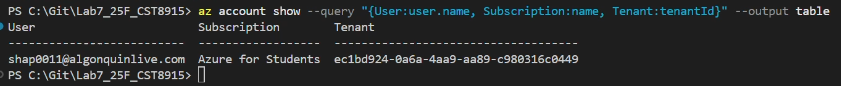
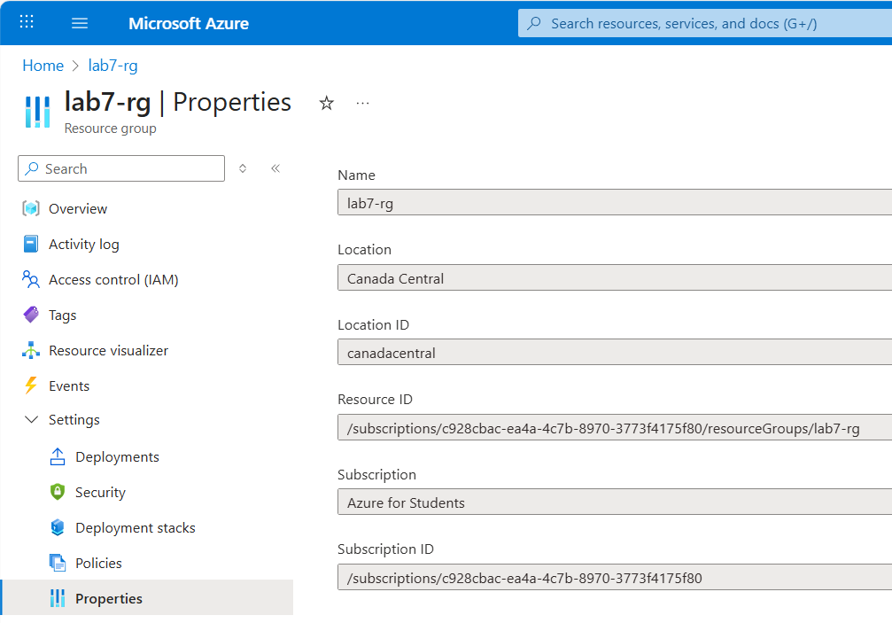
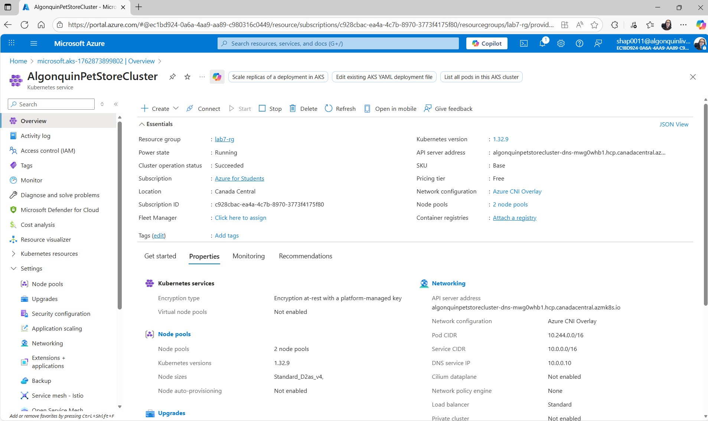
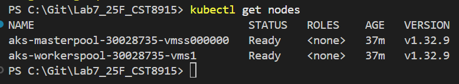
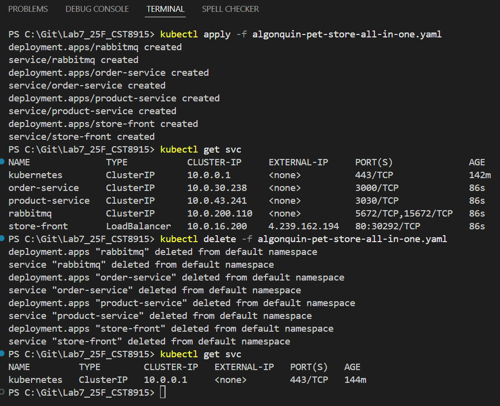
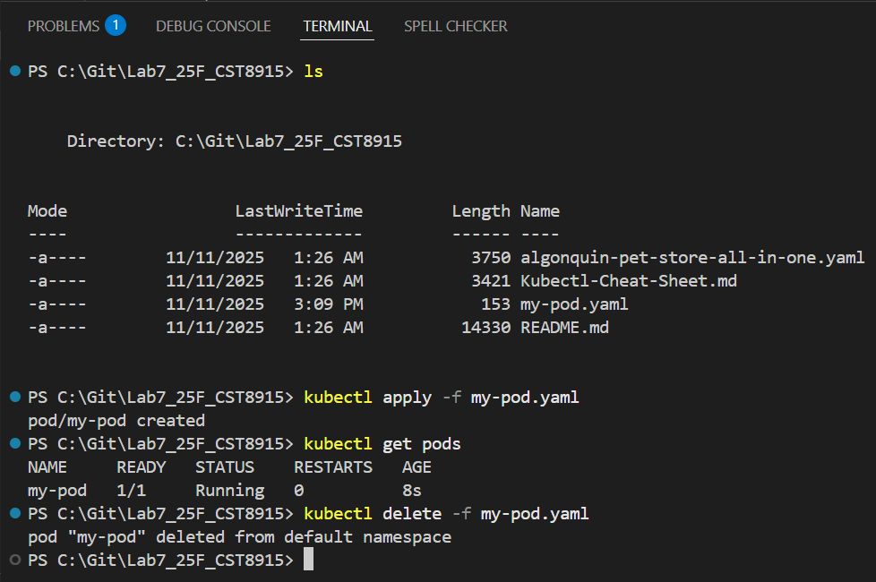
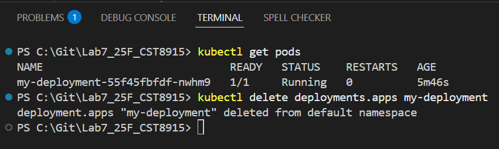
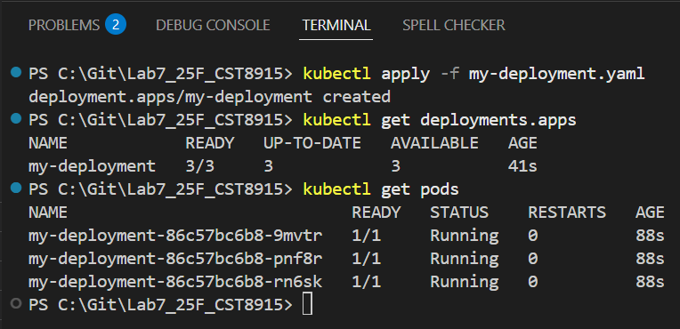
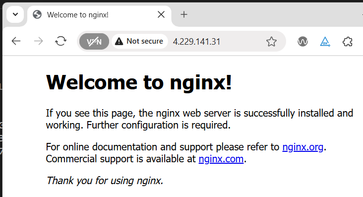
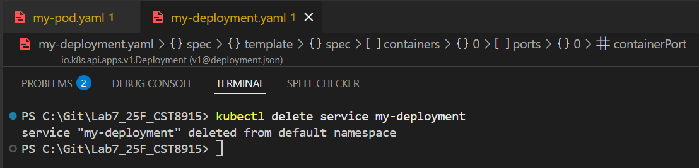

# Lab 7 - CST8915 Full-stack Cloud-native Development: Introduction to Kubernetes Basics

**Student: Olga Durham**

**St#: 040687883**

---

# In this lab:

Explore the foundational concepts of Kubernetes, focusing on using `kubectl` for basic operations, understanding the structure of Kubernetes YAML configuration files, and creating essential Kubernetes resources such as Pods, Deployments, and Services.

---

<u><b>[LINK TO VIDEO]()</b></u>

# Lab Objectives:

1. Understand the basic structure of a Kubernetes YAML file.
2. Learn how to create Kubernetes objects using `kubectl` and YAML files.

---

# Step 1: Azure login

In PowerShell terminal confirm that Azure CLI installed

```
az version
```

Confirm that `kubectl` installed

```
kubectl version --client
```

Login to Azure account under your username (email)

```
az login
```

Select the subscription email

Set the proper subscription "Azure for Students"



---

# Step 2: Create resource group, create an AKS Cluster

## Step 2.1: Create resource group

Resource group created



## Step 2.2: Create an AKS Cluster

AKS Cluster created



## Step 2.3: Get nodes

Get nodes



---

## Applying the YAML File

To create the resource defined in a YAML file, use the following command:

```
kubectl apply -f algonquin-pet-store-all-in-one.yaml
```

This command instructs Kubernetes to create or update the resource based on the YAML file. YAML files provide an easy way to manage configurations, making it simple to reproduce, modify, and apply resource definitions across environments.

Run the following command to delete all resources defined in the YAML file.

```
kubectl delete -f algonquin-pet-store-all-in-one.yaml
```

Apply `YAML` file and delete



---

# Step 3: Create Resources Using kubectl and YAML

This section will show you how to create kubernetes resources using kubectl command and YAML file.

## Create an Azure Kubernetes Cluster:

Create an AKS cluster with one worker node for this exercise.

## Create a Pod:

- Using `kubectl`:

Run the following command to create a Pod directly

```
kubectl run my-pod --image=nginx --port=80
```

Run the following command to delete this Pod:

```
kubectl delete pods my-pod
```

**Create, describe, and delete pod commands PowerShell output**

```
PS C:\Git\Lab7_25F_CST8915> kubectl run my-pod --image=nginx --port=80
pod/my-pod created
PS C:\Git\Lab7_25F_CST8915> kubectl get pods
NAME     READY   STATUS    RESTARTS   AGE
my-pod   1/1     Running   0          11s
PS C:\Git\Lab7_25F_CST8915> kubectl describe pods
Name:             my-pod
Namespace:        default
Priority:         0
Service Account:  default
Node:             aks-workerspool-30028735-vms1/10.224.0.5
Start Time:       Tue, 11 Nov 2025 13:29:02 -0500
Labels:           run=my-pod
Annotations:      <none>
Status:           Running
IP:               10.244.1.228
IPs:
  IP:  10.244.1.228
Containers:
  my-pod:
    Container ID:   containerd://8361b3e4afd44d34c4edc96f892078e020469320de076f00ad325457966f388d
    Image:          nginx
    Image ID:       docker.io/library/nginx@sha256:1beed3ca46acebe9d3fb62e9067f03d05d5bfa97a00f30938a0a3580563272ad
    Port:           80/TCP
    Host Port:      0/TCP
    State:          Running
      Started:      Tue, 11 Nov 2025 13:29:03 -0500
    Ready:          True
    Restart Count:  0
    Environment:    <none>
    Mounts:
      /var/run/secrets/kubernetes.io/serviceaccount from kube-api-access-rzqvd (ro)
Conditions:
  Type                        Status
  PodReadyToStartContainers   True
  Initialized                 True
  Ready                       True
  ContainersReady             True
  PodScheduled                True
Volumes:
  kube-api-access-rzqvd:
    Type:                    Projected (a volume that contains injected data from multiple sources)
    TokenExpirationSeconds:  3607
    ConfigMapName:           kube-root-ca.crt
    Optional:                false
    DownwardAPI:             true
QoS Class:                   BestEffort
Node-Selectors:              <none>
Tolerations:                 node.kubernetes.io/not-ready:NoExecute op=Exists for 300s
                             node.kubernetes.io/unreachable:NoExecute op=Exists for 300s
Events:
  Type    Reason     Age   From               Message
  ----    ------     ----  ----               -------
  Normal  Scheduled  20s   default-scheduler  Successfully assigned default/my-pod to aks-workerspool-30028735-vms1
  Normal  Pulling    19s   kubelet            Pulling image "nginx"
  Normal  Pulled     19s   kubelet            Successfully pulled image "nginx" in 305ms (305ms including waiting). Image size: 59774010 bytes.
  Normal  Created    19s   kubelet            Created container: my-pod
  Normal  Started    19s   kubelet            Started container my-pod
PS C:\Git\Lab7_25F_CST8915> kubectl delete pods my-pod
pod "my-pod" deleted from default namespace
PS C:\Git\Lab7_25F_CST8915>
```

- Using `YAML`

  - Save the following Pod YAML as `my-pod.yaml`

```
apiVersion: v1
kind: Pod
metadata:
  name: my-pod
spec:
  containers:
  - name: my-container
    image: nginx
    ports:
    - containerPort: 80
```

- Run the following command to apply the YAML file:

```
kubectl apply -f my-pod.yaml
```

- Verify Pod Creation:

```
kubectl get pods
```

- Run the following command to delete the pod:

```
kubectl delete -f my-pod.yaml
```

**Create and delete pod using YAML file**

[my-pod.yaml](https://github.com/shap0011/Lab7_25F_CST8915/blob/main/my-pod.yaml)



## Create a Deployment:

- Using kubectl:

```
kubectl create deployment my-deployment --image=nginx
```

Run the following command to delete the deployment:

```
kubectl delete deployments.apps my-deployment
```

**Verify created deployment and delete:**



- Using `**YAML**`

  - Create a file `**my-deployment.yaml**` with the following content:

  ```
  apiVersion: apps/v1
  kind: Deployment
  metadata:
    name: my-deployment
  spec:
    replicas: 3
    selector:
      matchLabels:
        app: nginx
    template:
      metadata:
        labels:
          app: nginx
      spec:
        containers:
        - name: nginx
          image: nginx
          ports:
          - containerPort: 80
  ```

- This YAML file defines a Kubernetes Deployment resource named my-deployment using the apps/v1 API version.

- The Deployment specifies that **three replicas** of the application should be running, ensuring that three identical Pods are deployed and maintained

- Each Pod created by this Deployment will match the label `**app: nginx**`, which helps in grouping and identifying these Pods.

- The **template** section defines the configuration for each Pod, setting metadata labels and a specification that describes a single container.

- The container, named `nginx`, uses the `nginx` image and exposes port `80` within the container, allowing traffic directed to this port.

- This configuration enables Kubernetes to manage and maintain the desired state of the application, automatically handling scaling, rolling updates, and rescheduling Pods if needed.

- Run the following command to apply the YAML file:

```
kubectl apply -f my-deployment.yaml
```

- Verify Deployment and Pods:

```
kubectl get deployments
```

```
kubectl get pods
```

**Create deployment using YAML file**

[my-deployment.yaml](https://github.com/shap0011/Lab7_25F_CST8915/blob/main/my-deployment.yaml)



## Create a Service:

- Using `kubectl`:

  - Expose my-deployment as a Service with kubectl:

    ```
    kubectl expose deployment my-deployment --type=LoadBalancer --port=80
    ```

**nginx web server installed**



- To delete this service:

  ```
  kubectl delete service my-deployment
  ```

**Delete service my-deployment**



- Using `YAML`

  - Create a file my-service.yaml with the following content:

  ```
  apiVersion: v1
  kind: Service
  metadata:
    name: my-service
  spec:
    selector:
      app: nginx
    type: LoadBalancer
    ports:

    - protocol: TCP
      port: 80
      targetPort: 80
  ```

- This YAML file defines a Kubernetes Service resource named `my-service` using API version v1.

- The Service is of type LoadBalancer, which means it will expose the application to external traffic through a load balancer, making it accessible outside the Kubernetes cluster.

- The selector specifies `app: nginx`, so this Service will `route traffic to all Pods that have this label`, effectively balancing traffic across those Pods.

- The ports section defines that the Service will listen on port `80` (accessible to external clients) and forward this traffic to port `80` on the target Pods.

- This setup enables seamless load balancing and external access to the application running within the cluster.

- Apply the YAML:

  ```
  kubectl apply -f my-service.yaml
  ```

- Verify the service:

  ```
  kubectl get services
  ```

  Note the `EXTERNAL-IP` assigned to the LoadBalancer Service for accessing the application externally.

- Delete the service:

  ```
  kubectl delete -f my-service.yaml
  ```

  - Delete the deployment:

  ```
  kubectl delete -f my-deployment.yaml
  ```

  - Verify that you deleted all resources created.

---

# Step 4: Defining Multiple Kubernetes Resources in a Single YAML File

In Kubernetes, you can define multiple resources in a single YAML file by separating each resource with `---`. This approach allows you to group related resources, such as a Deployment and its corresponding Service, into one file. By combining these resources, you can apply and manage them together with a single command, making deployment easier and keeping configurations organized.

### Example: The `algonquin-pet-store-all-in-one.yaml` File

In this file, we define Deployments and Services for the various components of the `Algonquin Pet Store` application, including RabbitMQ, Order Service, Product Service, and Store Front. Each section specifies a different resource, separated by `---` to clearly distinguish them.

Here’s a breakdown of the resources defined in the file:

### 1. RabbitMQ Deployment and Service:

- The first section creates a Deployment for RabbitMQ, defining a single replica with environment variables for user credentials.

- The Service for RabbitMQ exposes both the AMQP port (5672) for messaging and the management interface (15672) within the cluster.

### 2. Order Service Deployment and Service:

- The second section defines a Deployment for the Order Service with one replica, connecting it to RabbitMQ via an environment variable that specifies the connection string.

- The Service for Order Service exposes it on port `3000`, making it accessible within the cluster.

### 3. Product Service Deployment and Service:

- The third section defines a Deployment for the Product Service, again with one replica, exposing its API on port `3030`.

- The corresponding Service exposes this port internally within the cluster.

### 4. Store Front Deployment and Service:

- The final section defines a Deployment for the Store Front, setting up a single replica that serves as the frontend.

- The Service for the Store Front is of type `LoadBalancer`, exposing port `80` to external traffic so that users outside the cluster can access the frontend.

## Applying and Managing Combined Resources

By combining all resources into a single file, you can easily deploy the entire application stack with one command:

```
kubectl apply -f algonquin-pet-store-all-in-one.yaml
```

Similarly, to delete all resources defined in the file:

```
kubectl delete -f algonquin-pet-store-all-in-one.yaml
```

This setup allows you to deploy or manage all components of the application in a single step, simplifying the process and ensuring all parts of the application are consistently defined and deployed together.

---

# Important: Clean Up Azure Resources

## Lab Tasks

### 1. Examine `algonquin-pet-store-all-in-one.yaml`:

- Open the algonquin-pet-store-all-in-one.yaml file provided in this lab. Review each section carefully, paying particular attention to the RabbitMQ component, which includes both a Deployment and a Service configuration.

### 2. Identify Potential Issues with RabbitMQ Configuration:

- Think about how RabbitMQ handles data and the challenges it may face.

- Consider the implications of running RabbitMQ without persistent storage, especially if the pod is deleted or restarted.

- Is RabbitMQ Stateless or Stateful application?

---

# Submission

## What to Submit

### 1. Demo Video (Max 5 minutes)

- Record a short demo video for the lab that includes:
  - Deploying the Algonquin Pet Store application using the algonquin-pet-store-all-in-one.yaml file
  - Demonstrate the RabbitMQ configuration problem.

### 2. GitHub Repository (Submission Repo)

- You must create one GitHub repository for your lab submission.

- This submission repository must include:

  - A `README.md` file with:

    - The YouTube demo video link

    - Your written analysis of the RabbitMQ configuration issues, including:

      - Whether RabbitMQ is a stateless or stateful application

      - The implications of running RabbitMQ without persistent storage

      - What happens when the RabbitMQ pod is deleted or restarted

      - Potential solutions to this problem (research-based)

      - Does using Azure Service Bus solve the issues identified with RabbitMQ Configuration in this Lab?

      - (Optional) Notes about setup challenges or lessons learned.

# How to Submit

- Push your work to a **public GitHub repository** (the submission repository).

- Submit the link to your submission repository as your final lab deliverable in **Brightspace**.
