# Lab 8 - CST8915 Full-stack Cloud-native Development: Deploying and Managing the Algonquin Pet Store (On Steroids)

**Student: Olga Durham**

**St#: 040687883**

---

Deploy and manage a microservices-based application, [Algonquin Pet Store (On Steroids)](https://github.com/ramymohamed10/algonquin-pet-store-on-steroids), into a Kubernetes cluster.

---

## Lab Objectives

1. Deploy the Algonquin Pet Store (On Steroids) application to a Kubernetes cluster.
2. Configure and manage essential Kubernetes resources like StatefulSets, Secrets, ConfigMaps, and Deployments.
3. Test the application's features, including backend services, frontend interfaces, and AI integration.
4. Scale services and monitor application health.
5. Simulate customer and worker tasks using Virtual Customer and Virtual Worker services.

---

## Step 1: Clone the Algonquin Pet Store Repository

To begin, clone the [**Algonquin Pet Store (On Steroids)**](https://github.com/ramymohamed10/algonquin-pet-store-on-steroids) repository, which contains all necessary deployment files.

**Review the Deployment Files**:

- Navigate to the `Deployment Files` folder
- This folder contains YAML files for deploying all necessary Kubernetes resources, including services, deployments, StatefulSets, ConfigMaps, and Secrets.

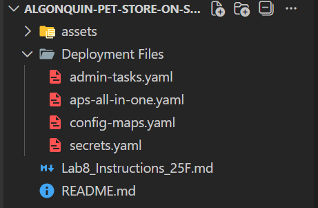

## Step 2: Set Up the AKS Cluster

Create an AKS cluster with two worker nodes for this exercise. For this step, you can refer to **Lab 6**

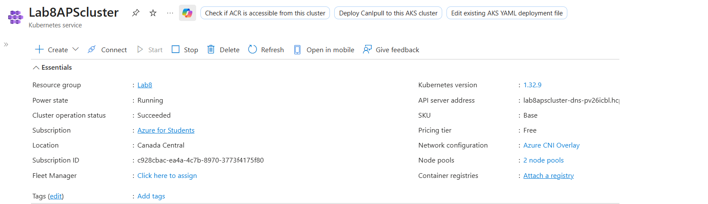

_NOTE: Only two node pools possible to create for `Azure for Students` subscription._

## Step 3: Set Up the AI Backing Services

To enable AI-generated product descriptions and image generation features, you will deploy the required **Azure OpenAI Services** for GPT-4 (text generation) and DALL-E 3 (image generation). This step is essential to configure the **AI Service** component in the Algonquin Pet Store application.

### Task 1: Create an Azure OpenAI Service Instance

1. **Navigate to Azure Portal**:

   - Go to the [Azure Portal](https://portal.azure.com/).

2. **Create a Resource**:

   - Select **Create a Resource** from the Azure portal dashboard.
   - Search for **Azure OpenAI** in the marketplace.

3. **Set Up the Azure OpenAI Resource**:

   - Choose the **East US** region for deployment to ensure capacity for GPT-4 and DALL-E 3 models.
   - Fill in the required details:
     - Resource group: Use an existing one or create a new group.
     - Pricing tier: Select `Standard`.

4. **Deploy the Resource**:
   - Click **Review + Create** and then **Create** to deploy the Azure OpenAI service.

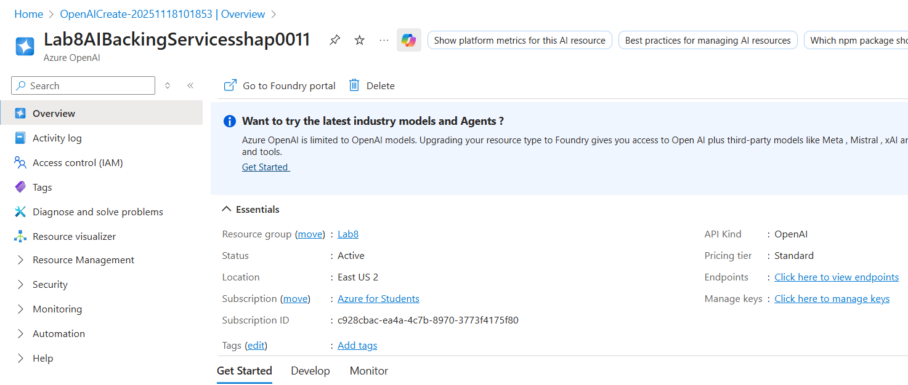

_NOTE: Region `East US` is disallowed. Region `East US 2` is OK._

---

### Task 2: Deploy the GPT-4 and DALL-E 3 Models

1. **Access the Azure OpenAI Resource**:

   - Navigate to the Azure OpenAI resource you just created.

2. **Deploy GPT-4**:

   - Go to the **Model Deployments** section and click **Add Deployment**.
   - Choose **GPT-4** as the model and provide a deployment name (e.g., `gpt-4-deployment`).
   - Set the deployment configuration as required and deploy the model.

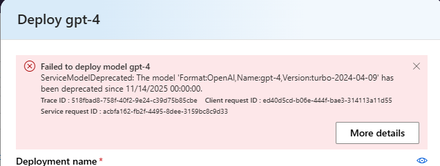

_NOTE: Chat `gpt-4` is deprecated. Chat `gpt-4o` is available for deployment._

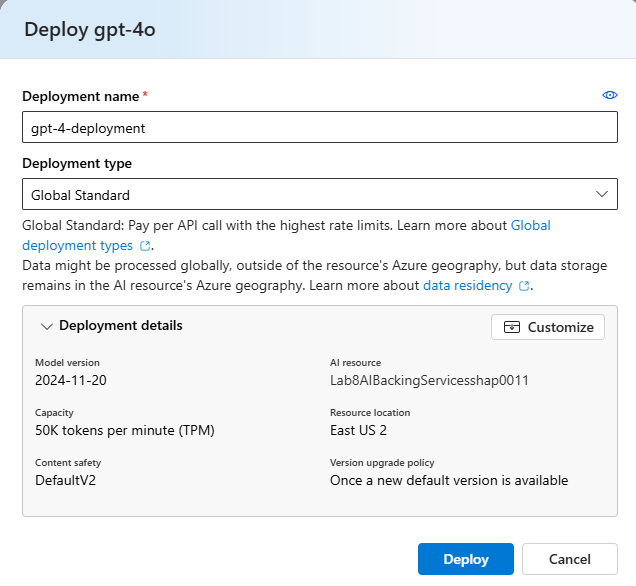

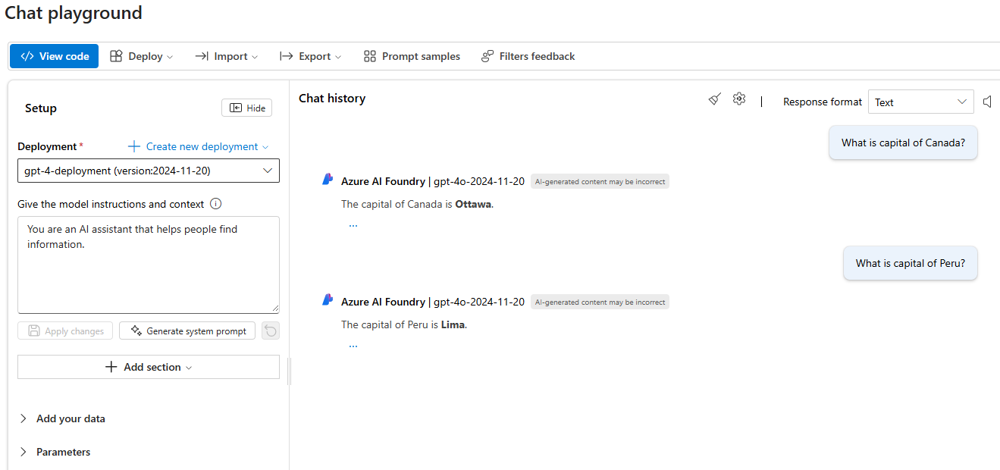

3. **Deploy DALL-E 3**:

   - Repeat the same process to deploy **DALL-E 3**.
   - Use a descriptive deployment name (e.g., `dalle-3-deployment`).

_NOTE: Available resource location is `Sweden Central` only._

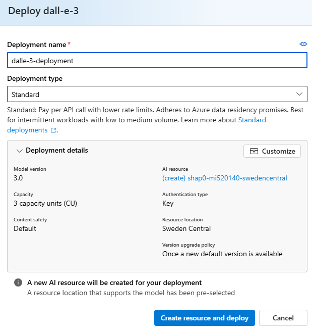


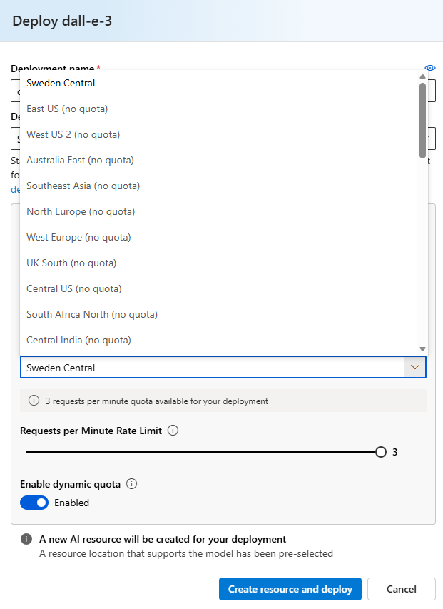

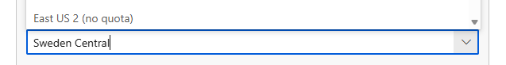

_Note on DALL·E 3 Deployment:_

_dall-e-3 could not be deployed due to Azure for Students restrictions._

_My subscription has no available quota for dall-e-3 in allowed regions (e.g., East US 2), and the only region with quota (Sweden Central) is blocked by the subscription’s location policy._

_As a result, only GPT-4o was deployed for text generation, and the image generation feature is not enabled. All other lab components work normally._

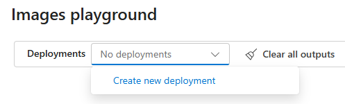

_NOTE on image creation:_

_Image model deployment (DALL·E 2/3) was not possible due to Azure for Students restrictions._

_All image model regions show “no quota,” and the only region with available quota (Sweden Central) is blocked by the subscription’s allowed-locations policy._

_As a result, the Images playground shows no deployments, and image generation is not supported under this subscription._

4. **Note Configuration Details**:
   - Once deployed, note down the following details for each model:
     - Deployment Name
     - Endpoint URL

**Model:** `gpt-4o`

**Deployment name:** `gpt-4-deployment`

**Endpoint URL:** `https://lab8aibackingservicesshap0011.openai.azure.com/`

---

### Task 3: Retrieve and Configure API Keys

1. **Get API Keys:**

   - Go to the **Keys and Endpoints** section of your Azure OpenAI resource.
   - Copy the **API Key (API key 1)** and **Endpoint URL**.

2. **Base64 Encode the API Key**:

   - Use the following command to Base64 encode your API key:
     ```bash
     echo -n "<your-api-key>" | base64
     ```
   - Replace `<your-api-key>` with your actual API key.

   hello

---

### Task 4: Update AI Service Deployment Configuration in the `Deployment Files` folder.

1. **Modify Secretes YAML**:
   - Edit the `secrets.yaml` file.
   - Replace `OPENAI_API_KEY` placeholder with the Base64-encoded value of the `API_KEY`.

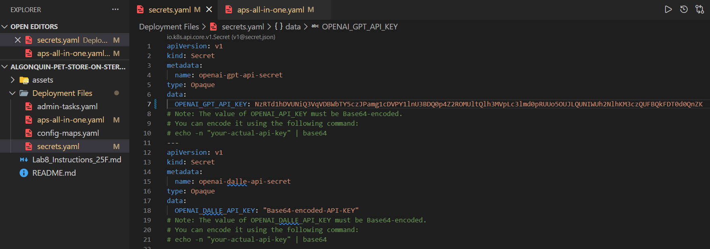

2. **Modify Deployment YAML**:

   - Edit the `aps-all-in-one.yaml` file.
   - Replace the placeholders with the configurations you retrieved:
     - `AZURE_OPENAI_DEPLOYMENT_NAME`: Enter the deployment name for GPT-4o.
     - `AZURE_OPENAI_ENDPOINT`: Enter the endpoint URL for the GPT-4o deployment.
     - `AZURE_OPENAI_DALLE_ENDPOINT`: Enter the endpoint URL for the DALL-E 3 deployment. _NOTE: Not available for Student subscription_
     - `AZURE_OPENAI_DALLE_DEPLOYMENT_NAME`: Enter the deployment name for DALL-E 3. _NOTE: Not available for Student subscription_

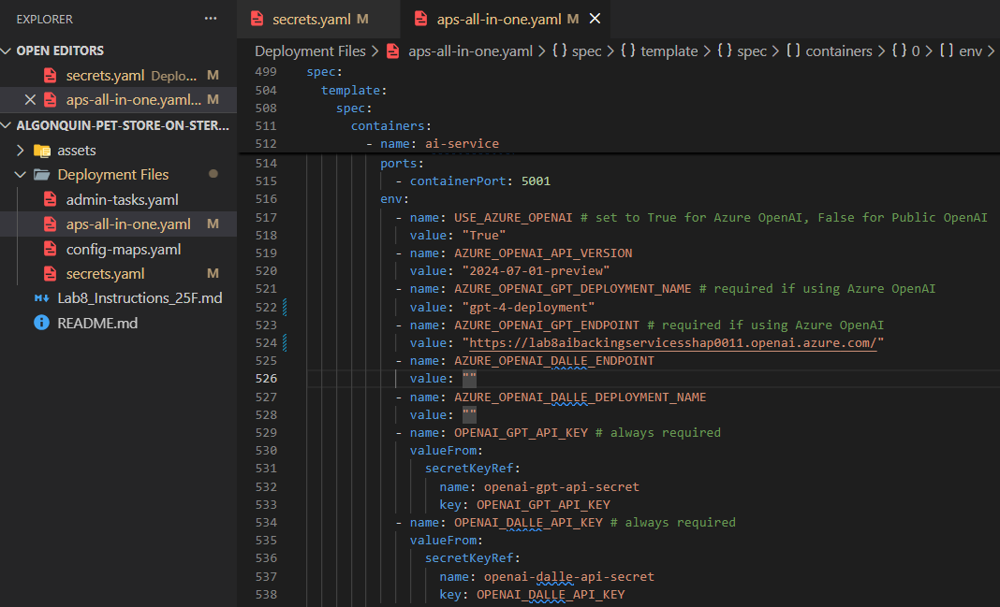

Example configuration in the YAML file:

```yaml
- name: AZURE_OPENAI_API_VERSION
  value: "2024-07-01-preview"
- name: AZURE_OPENAI_DEPLOYMENT_NAME
  value: "gpt-4-deployment"
- name: AZURE_OPENAI_ENDPOINT
  value: "https://<your-openai-resource-name>.openai.azure.com/"
- name: AZURE_OPENAI_DALLE_ENDPOINT
  value: "https://<your-openai-resource-name>.openai.azure.com/"
- name: AZURE_OPENAI_DALLE_DEPLOYMENT_NAME
  value: "dalle-3-deployment"
```

## Step 4: Deploy the ConfigMaps and Secrets

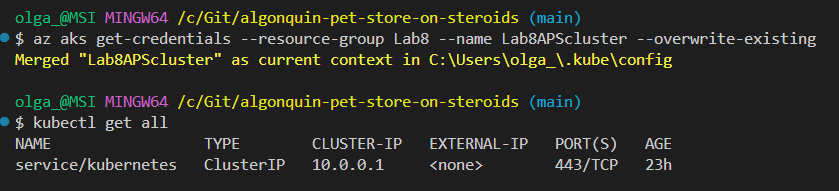

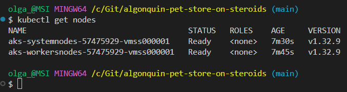

- Deploy the ConfigMap for RabbitMQ Plugins:

  ```bash
  kubectl apply -f config-maps.yaml
  ```

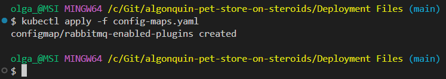

- Create and Deploy the Secret for OpenAI API:
  - Make sure that you have replaced Base64-encoded-API-KEY in secrets.yaml with your Base64-encoded OpenAI API key.
  ```bash
  kubectl apply -f secrets.yaml
  ```

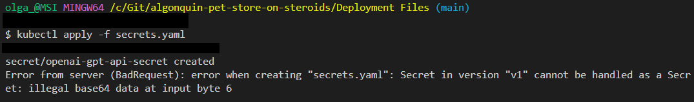

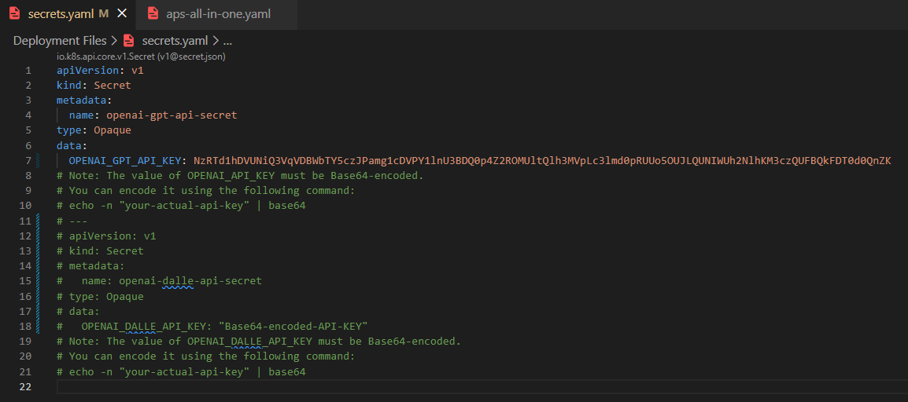

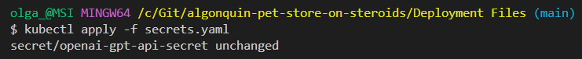

- Verify:

  ```bash
  kubectl get configmaps
  kubectl get secrets
  ```

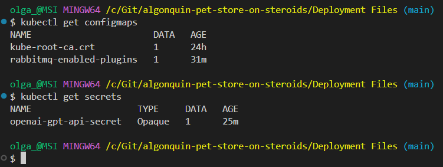

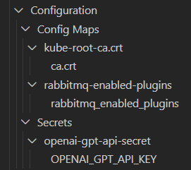

## Step 5: Deploy the Application

```bash
kubectl apply -f aps-all-in-one.yaml
```

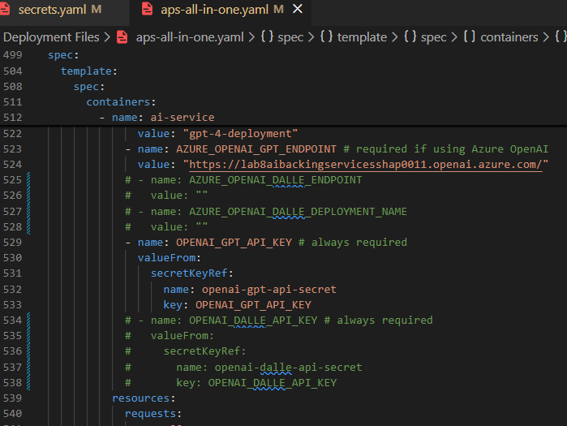

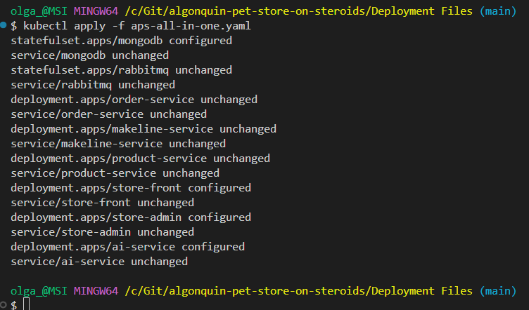

### Validate the Deployment

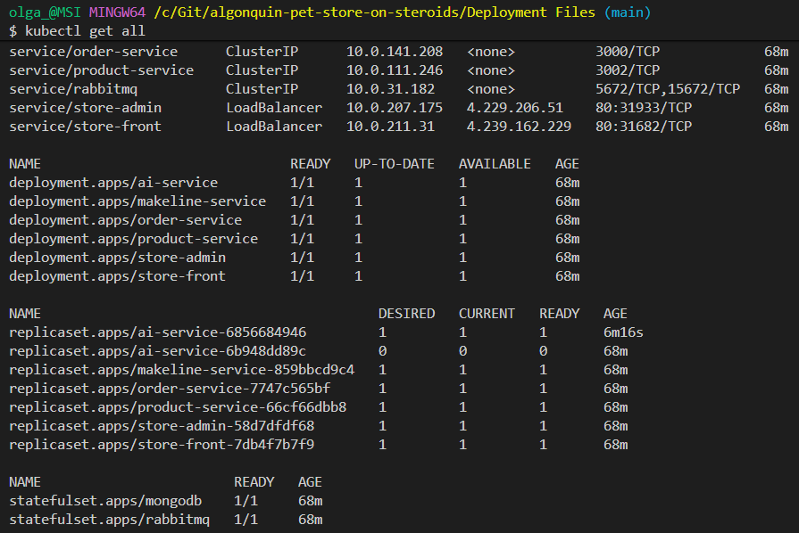

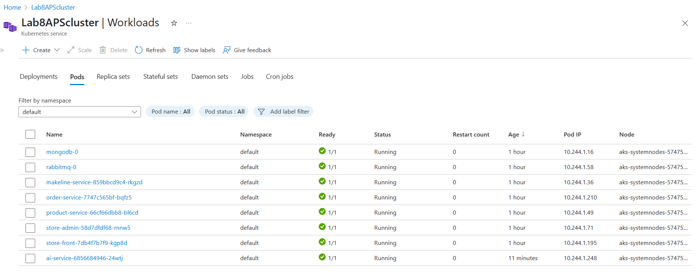

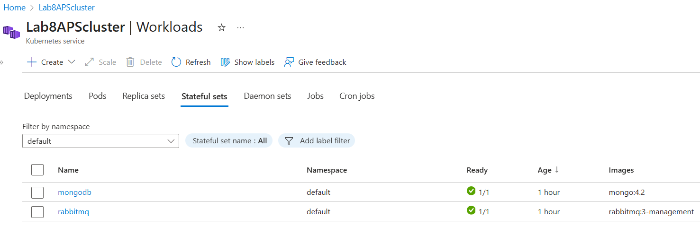

- Check Pods and Services:

  ```bash
  kubectl get pods
  kubectl get services
  ```

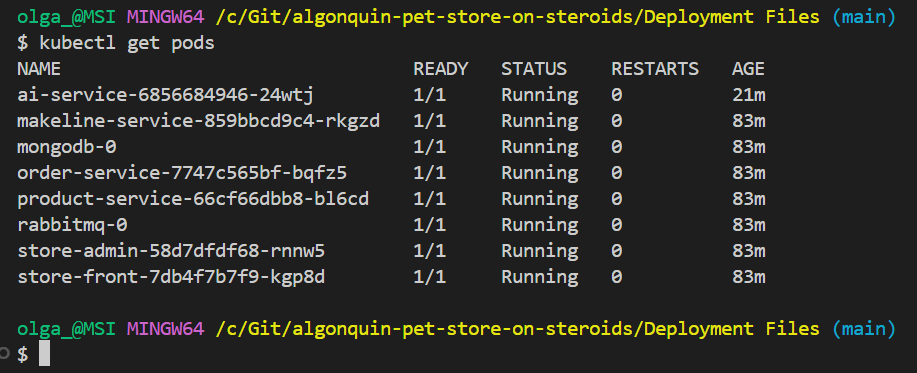

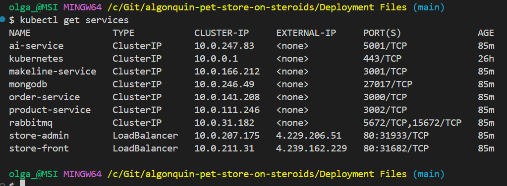

- Test Frontend Access:

  - Locate the external IPs for store-front and store-admin services:

  ```bash
  kubectl get services
  ```

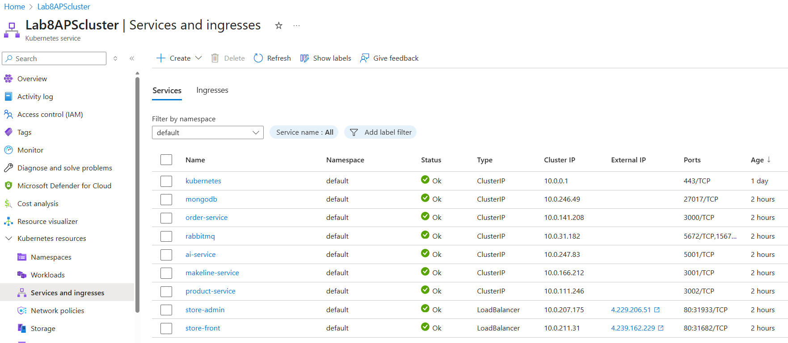

- Access the Store Front app at the external IP on port 80.

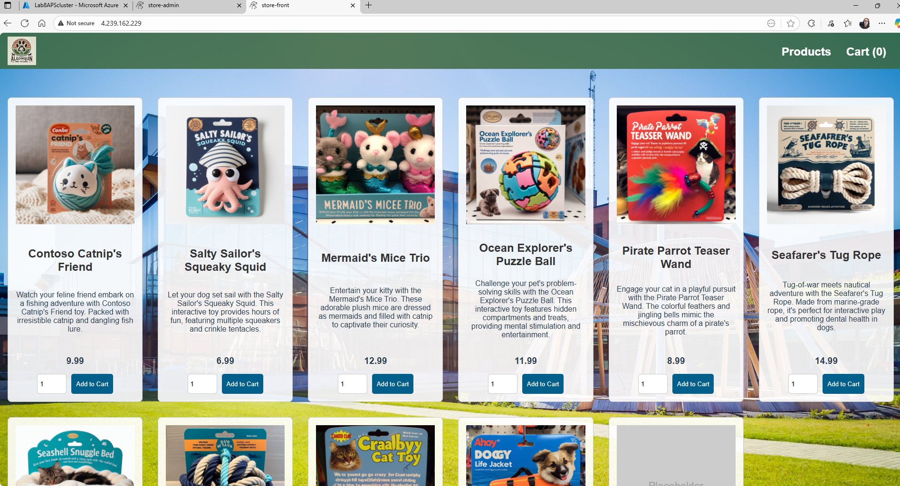

- Access the Store Admin app at the external IP on port 80.

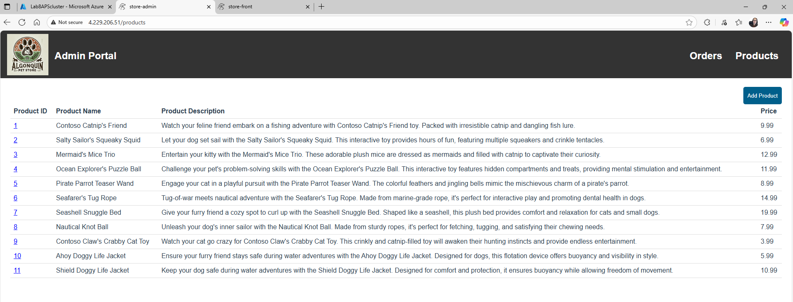

## Step 6: Deploy Virtual Customer and Worker

```bash
kubectl apply -f admin-tasks.yaml
```

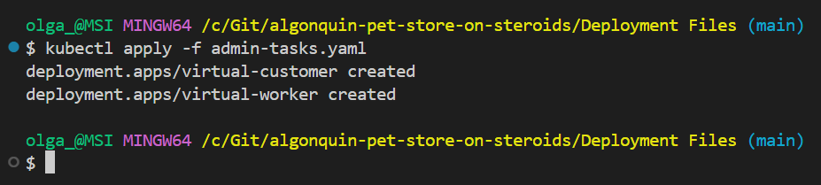

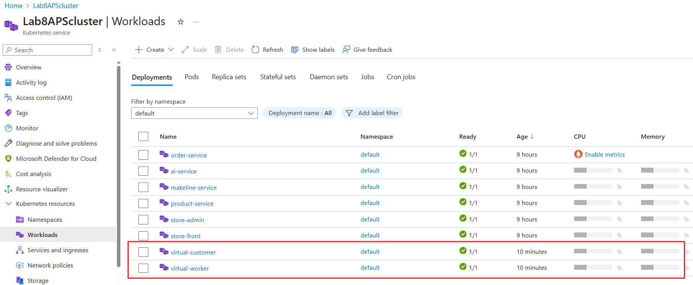

- Monitor Virtual Customer:

  ```bash
  kubectl logs -f deployment/virtual-customer
  ```

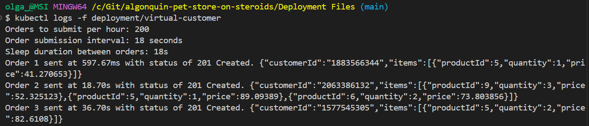

- Monitor Virtual Worker:

  ```bash
  kubectl logs -f deployment/virtual-worker
  ```

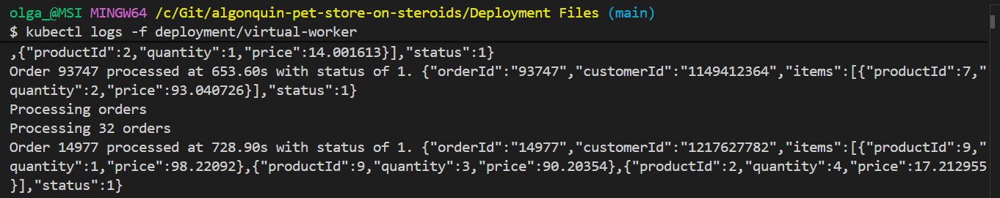

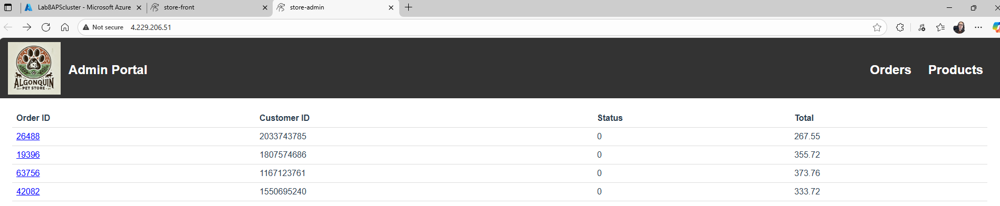

## Step 7: Scale and Monitor Services


### Scale Deployments:

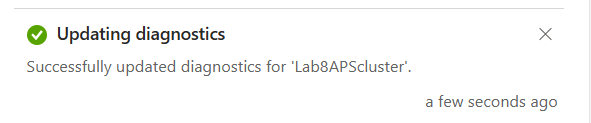


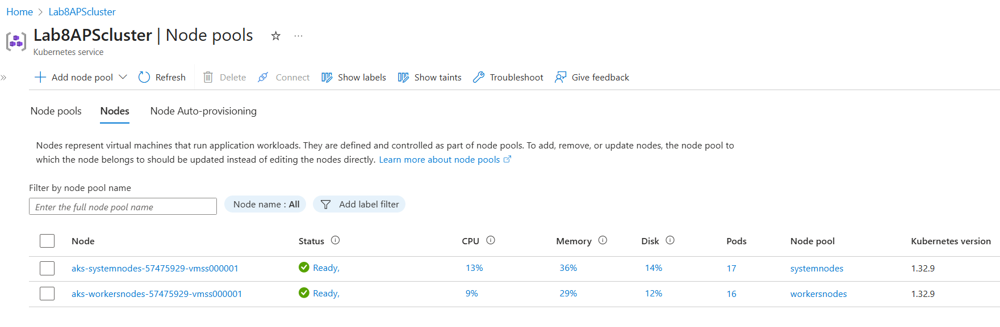

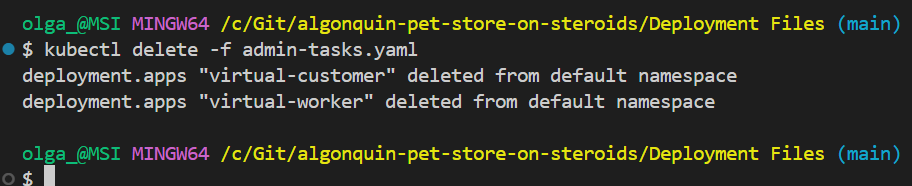

- Scale the `order-service` to 3 replicas:

```bash
kubectl scale deployment order-service --replicas=3
```

- Check Scaling:

```bash
kubectl get pods
```

- Monitor Resource Usage:

  - Enable metrics server for resource monitoring.
  - Use kubectl top to monitor pod and node usage:

  ```bash
  kubectl top pods
  kubectl top nodes
  ```

## Step 8: Explore Advanced Features

### AI-Generated Descriptions and Images:

- Use the AI Service for generating product descriptions and images.
- Ensure your OpenAI API key is correctly configured in the deployed secret.

### RabbitMQ Management:

- Access the RabbitMQ management UI:

  ```bash
  kubectl port-forward service/rabbitmq 15672:15672
  ```

  The kubectl port-forward command is used to forward a local port to a port on a Kubernetes resource (e.g., a Pod or Service). This allows you to access the application running in the cluster from your local machine without exposing it externally.

- Login with the default credentials (`username`/`password`).

### MongoDB Shell Access and Database Exploration

In this section, you will use the MongoDB shell to interact with the `orderdb` database, which stores order information for the Algonquin Pet Store application. Follow the steps below to connect to the MongoDB pod and explore its contents.

#### **1- Access the MongoDB Shell**

Run the following command to connect to the MongoDB shell inside the running MongoDB pod:

```bash
kubectl exec -it <mongodb-pod-name> -- mongo
```

Explanation: This command uses kubectl exec to open an interactive shell (-it) inside the MongoDB pod and starts the MongoDB shell program (mongo).

#### **2- List All Databases**

Once inside the MongoDB shell, run:

```bash
show dbs
```

Explanation: The show dbs command lists all databases available on the MongoDB server. You should see a list that includes the orderdb, which stores order-related data for the application.

#### **3- Switch to the Order Database**

```bash
use orderdb
```

Explanation: The use orderdb command selects the orderdb database, making it the active database for subsequent queries and commands.

#### **4- List Collections in the Database**

Display all collections in the orderdb database:

```bash
show collections
```

Explanation: The show collections command lists all collections (similar to tables in relational databases) in the current database. The orders collection contains the order data.

#### **5- Query the Orders Collection**

Retrieve all documents in the orders collection:

```bash
db.orders.find()
```

Explanation: The db.orders.find() command fetches and displays all documents (records) in the orders collection. This allows you to view the stored order data, including details such as customer information, products, and order status.

#### By following these steps, you will:

- Connect to the MongoDB shell in the Kubernetes pod.
- Explore the databases and collections used by the application.
- Query the orders collection to examine the data structure and stored records.

# Lab Assignment Tasks

## **Task 1: Build, Push, and Deploy Your Own Docker Images**

You are asked to fork the necessary service repositories, build Docker images for each service, push them to your own Docker Hub account, and update the Kubernetes configuration file to use your images.

---

### **Step 1: Fork the Repositories**

1. **Fork Each Repository**:

   - Visit the GitHub repositories for the services listed below and fork them into your own GitHub account:

   | Service            | Description                              | Github Repo                                                                 |
   | ------------------ | ---------------------------------------- | --------------------------------------------------------------------------- |
   | `store-front`      | Web app for customers to place orders    | [store-front-L8](https://github.com/ramymohamed10/store-front-L8)           |
   | `store-admin`      | Web app for store employees              | [store-admin-L8](https://github.com/ramymohamed10/store-admin-L8)           |
   | `order-service`    | Handles order placement                  | [order-service-L8](https://github.com/ramymohamed10/order-service-L8)       |
   | `product-service`  | Handles CRUD operations on products      | [product-service-L8](https://github.com/ramymohamed10/product-service-L8)   |
   | `makeline-service` | Processes and completes orders           | [makeline-service-L8](https://github.com/ramymohamed10/makeline-service-L8) |
   | `ai-service`       | AI-based product descriptions and images | [ai-service-L8](https://github.com/ramymohamed10/ai-service-L8)             |
   | `virtual-customer` | Simulates customer order creation        | [virtual-customer-L8](https://github.com/ramymohamed10/virtual-customer-L8) |
   | `virtual-worker`   | Simulates order completion               | [virtual-worker-L8](https://github.com/ramymohamed10/virtual-worker-L8)     |

2. **Clone the Forked Repositories**:

---

### **Step 2: Build and Push Docker Images**

---

### **Step 3: Update `aps-all-in-one.yaml`**

---

### **Step 4: Test the Application**

## **Task 2: Improving and Extending the Deployment**

Currently, the deployment YAML runs `MongoDB` and `RabbitMQ` inside the Kubernetes cluster, but data is **ephemeral**. If the pods are deleted or the cluster restarts, all messages and database data are lost.

**Your tasks are to:**

- **Make MongoDB capable of high availability (replication) and persistent storage:**
  - Research PersistentVolumeClaim (PVC) and what a MongoDB Replica Set is and how it improves availability.
  - Modify the existing StatefulSet so that:
    - It has at least 3 replicas (`replicas: 3`).
    - Each replica has its own `PersistentVolumeClaim (PVC)` using a `volumeClaimTemplates` section.
    - The service becomes headless (`clusterIP: None`) for stable DNS names (`mongodb-0.mongodb`, etc.).
- **Enable RabbitMQ to store messages persistently:**
  - Currently, RabbitMQ data (queues, messages) disappears when the pod restarts.
  - Update the RabbitMQ StatefulSet to:
    - Mount a persistent volume at /var/lib/rabbitmq.
    - Use a volumeClaimTemplates block to create per-pod PVCs
    - Ensure the config map (plugins, definitions) remains mounted.
    - **Hint:** RabbitMQ stores its data in /var/lib/rabbitmq. Use PersistentVolumeClaim templates similar to MongoDB’s.
- **Investigate what Azure managed services could replace self-hosted MongoDB and RabbitMQ.**
  - For each service:
    - Give its name and purpose.
    - Explain why it’s a good fit (e.g., scaling, backups, availability).

## Submission

### What to Submit

1. **Demo Video (Max 5 minutes)**

   - Record a short demo video for the lab that includes:
     - Deploying the Algonquin Pet Store application using your updated `aps-all-in-one.yaml` file (from Task 1).
     - Prove MongoDB persistence + replica set (from Task 2).
     - Prove RabbitMQ persistence (from Task 2).

2. **GitHub Repository (Submission Repo)**
   - You must create **one GitHub repository** for your lab submission.
   - This submission repository must include:
     - A `README.md` file with:
       - The YouTube demo video link
       - Written explanation of your solution to Task 2
       - Your updated `aps-all-in-one-Task1.yaml` file used for Task 1
       - Your updated `aps-all-in-one-Task2.yaml` file used for Task 2

### How to Submit

- Push your work to a **public GitHub repository** (the submission repository).
- Submit the link to your submission repository as your final lab deliverable in **Brightspace**.
